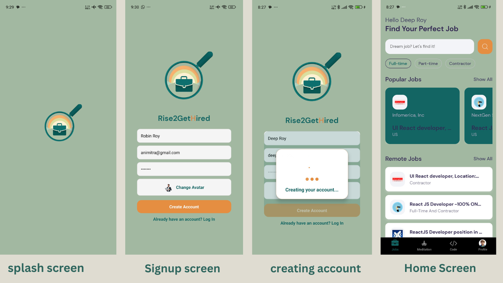
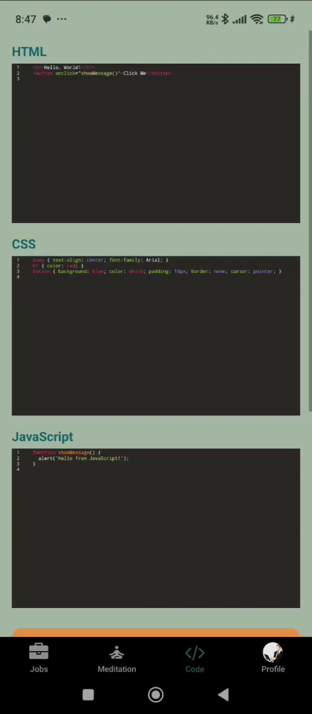
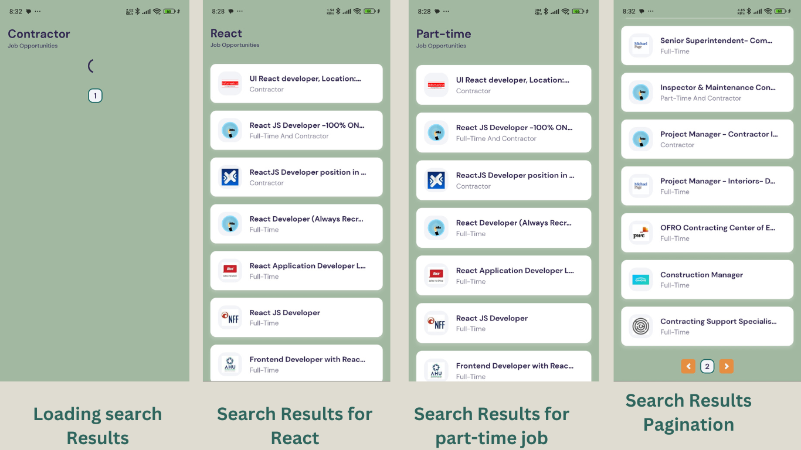
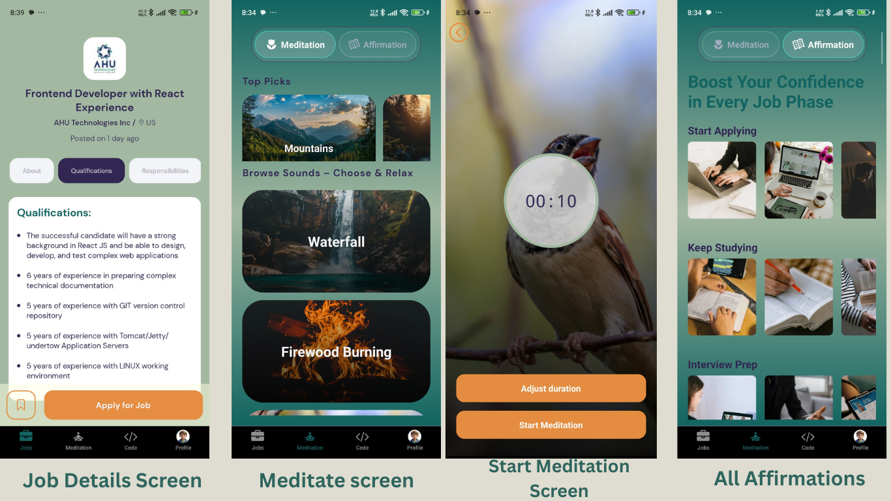
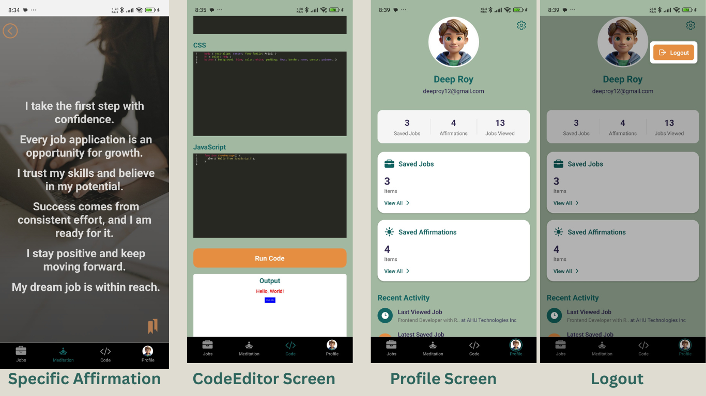

# 📱 Rise2getHired

<p align="center">
  
</p>

_**Rise2GetHired** – A full-stack React Native app with Expo, Express, MongoDB, and Mongoose, offering seamless job search, real-time coding practice, meditation for stress relief, and job-related affirmations—all in a beautifully designed, user-friendly interface._

## ✨ What This Project Does

**Rise2GetHired** is an all-in-one platform that streamlines the entire job application journey, seamlessly integrating job searching, coding practice, stress management, and self-motivation. Built with React Native, Expo, Express, MongoDB, and Mongoose, it offers a structured and intuitive experience. Users can browse the latest job listings, filter by title or location, view details, apply directly, and save opportunities for later.

Beyond job searching, the app features a built-in coding editor for practicing interview questions, a meditation section with white noise and customizable timers to reduce stress, and an affirmation hub with motivational content tailored to different job-seeking phases. A personalized profile dashboard tracks user activity, offering insights into job views, saves, applications, and affirmations. With a sleek, professional UI, **Rise2GetHired** is the ultimate one-stop solution for job seekers.

## 🚀 Live Demo

Experience the project in action:

- 🌐 [Live Demo Link](https://your-demo-link.com)
- 🎥 [Video Demo](https://your-video-demo-link.com)

## 📸 Preview

### 🏠 Home Screen



_Clean and modern design_

---

## 🎞️ Interactive Previews

### 👤 Signup


_Quick and easy sign-up to kickstart your job search_

### 💼 Job Section


_Explore, filter, and apply for jobs effortlessly—all in one place._

### 🌷 Meditate Section


_Relax and stay focused with guided meditation and soothing sounds._

### 📖 Affirmation Section


_Stay motivated with job-Phase specific affirmations._

### 🧑🏾‍💻 Code Editor Section



_Practice coding with an interactive code editor._

### 🧑🏾 Profile Section


_Track your job search progress and saved content in your profile dashboard._

---

## 📷 Additional Screenshots

### Search Results

<details>
<summary>View Screenshot</summary>



_Comprehensive search results with filtering options for job title and location_

</details>

### Different Sections-1

<details>
<summary>View Screenshot</summary>



_Job detail view with description, requirements, and application options in a clean interface_

</details>

### Different Sections-2

<details>
<summary>View Screenshot</summary>



_Code editor interface with syntax highlighting and execution capabilities for technical interview preparation_

</details>

### Different Sections-3

<details>
<summary>View Screenshot</summary>


_Meditation section with timer controls and ambient sound selection for stress management_

</details>

## ✨ Features

- 🔍 **Advanced Job Search**: Discover the latest job openings with filters for job title and location, making job hunting effortless.

- 📄 **Detailed Job Views**: Access well-structured job details, including descriptions, requirements, and direct application links in an easy-to-read format.

- 💾 **Save & Track Jobs**: Bookmark jobs for future applications and track your viewed and saved listings within your profile.

- 💻 **In-App Coding Practice**: Prepare for technical interviews with a built-in code editor designed for practicing console-based coding questions.

- 🧘 **Meditation for Focus**: Stay stress-free during the job search with guided meditation, white noise, and customizable timers.

- 💬 **Motivational Affirmations**: Strengthen self-confidence with curated affirmations for different job application phases like interviews, rejections, and career growth.

- 📊 **Personalized Profile Dashboard**: Track job application progress, saved jobs, affirmations, and engagement stats in a structured view.

- 🎨 **Professional UI & Design**: Navigate a sleek, modern interface with a thoughtfully crafted color scheme for an intuitive and engaging experience.

## 🛠 Tech Stack

### 🚀 Frontend

- **Framework**: React Native (Expo)
- **Navigation**: Expo Router, React Navigation
- **UI & Styling**: Expo Linear Gradient, Expo Blur, Lottie React Native, Expo Symbols
- **APIs & Networking**: Axios, Expo Web Browser
- **Animations & Haptics**: React Native Reanimated, Expo Haptics
- **Others**: Expo Status Bar, Expo Font, Expo Constants

### 🖥️ Backend

- **Server**: Express.js
- **Database**: MongoDB (Mongoose ORM)
- **Authentication & Security**: JSON Web Token (JWT), Bcrypt.js
- **Environment Management**: Dotenv
- **CORS Handling**: CORS

### 🌐 API

- **Job Search**: JSearch API (RapidAPI)

### 🚢 Deployment

- **Frontend**: Vercel
- **Backend**: Render

## 🔧 Installation

1. Clone the repository and navigate to the project folder:

   ```bash
   git clone https://github.com/yourusername/projectname.git
   cd projectname
   ```

2. Install dependencies for both frontend and backend:

   ```bash
   cd client
   npm install
   ```

   Open a new terminal:

   ```bash
   cd server
   npm install
   ```

3. Start the development servers:

   Backend:

   ```bash
   npm run dev
   ```

   Frontend:

   ```bash
   npm start
   ```

## 🎮 Usage

Running the App on a Physical Device:

- Scan the QR code displayed in the terminal using the Expo Go app.

Running on an Emulator:

- For Android: Press `a` in the terminal to open the app on an Android emulator.
- For iOS: Press `i` in the terminal to open the app on an iOS simulator.

Accessing the Backend:

- Visit http://localhost:5000/ in your browser to check the API.
- All backend routes are defined in the server.js file.

## 🤝 Contributing

We welcome contributions! Please follow these steps:

1. Fork the repository
2. Create your feature branch (`git checkout -b feature/AmazingFeature`)
3. Commit your changes (`git commit -m 'Add some AmazingFeature'`)
4. Push to the branch (`git push origin feature/AmazingFeature`)
5. Open a Pull Request

## 📬 Contact

- Your Name - [@yourtwitter](https://twitter.com/yourtwitter)
- Email - your.email@example.com
- Project Link: [https://github.com/yourusername/projectname](https://github.com/yourusername/projectname)

## 📊 Project Metrics

&nbsp;&nbsp;&nbsp;&nbsp;
&nbsp;&nbsp;&nbsp;&nbsp;
&nbsp;&nbsp;&nbsp;&nbsp;
&nbsp;&nbsp;&nbsp;&nbsp;


## 💻 Project Details

&nbsp;&nbsp;&nbsp;&nbsp;
&nbsp;&nbsp;&nbsp;&nbsp;
&nbsp;&nbsp;&nbsp;&nbsp;
&nbsp;&nbsp;&nbsp;&nbsp;

### 📊 Project Overview

| 📌 **Metric**          | 📊 **Value**     |
| ---------------------- | ---------------- |
| 📈 **Total Commits**   | 1,247            |
| 🕒 **Last Commit**     | 2024-02-20       |
| 💾 **Repo Size**       | 12.5 MB          |
| 📝 **Languages Count** | 3                |
| 💡 **Top Language**    | JavaScript - 72% |
| ❓ **Open Issues**     | 5                |
| 🌐 **Platform**        | Web, Mobile      |
| 📦 **Dependencies**    | 12               |
| 📅 **Version**         | 1.0.0            |
| 🚀 **Status**          | Deployed         |

## 🚀 Upcoming Future Feature Progress

- 💻 Integrate More Language Support in Code Editor (Python, Java, etc.) ▓░░░░░░░░░░░░░░░░░░░░░ 5%
- 💬 Job Community Messaging & Mentorship ░░░░░░░░░░░░░░░░░░░░░░ 0%

Made with ❤️ by [Your Name](https://github.com/yourusername)
